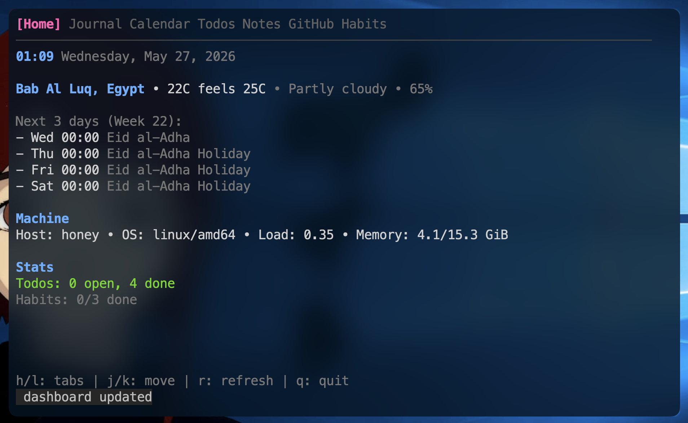
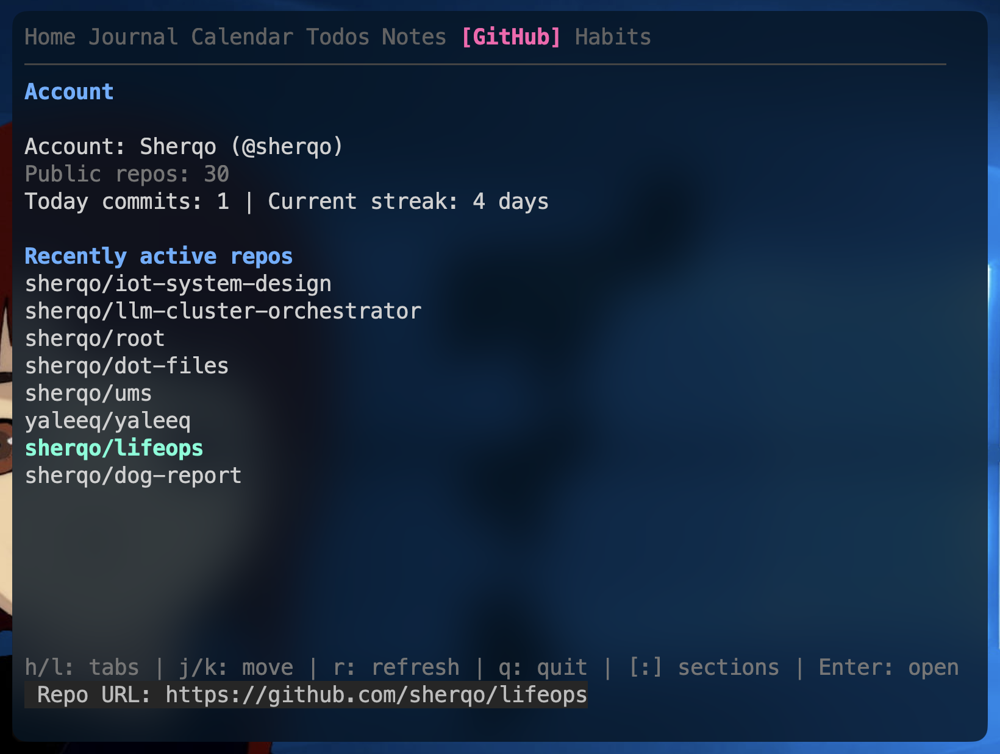

# lifeops

Tabbed terminal UI for personal operations: machine stats, weather, todos, markdown journal/notes, GitHub, and more.




## Install

```bash
go install github.com/sherqo/lifeops@latest
```

Or clone and run:

```bash
git clone https://github.com/sherqo/lifeops && cd lifeops
go run .
```

## Keys

| Key | Action |
|-----|--------|
| `h` / `l` | Previous/next tab |
| `j` / `k` | Move down/up in lists |
| `r` | Refresh current tab |
| `q` | Quit |
| `a` | Add item (Todos, Journal, Notes) |
| `e` | Toggle folder or open file (Journal/Notes/Books) |
| `w` | Edit current week journal file |
| `d` | Open current tab directory in a new terminal (Journal/Notes/Books) |
| `n` / `p` | Next/previous month (Calendar) |
| `T` | Today in Calendar |
| `x` / `space` | Toggle todo or habit |
| `f` | Cycle todo filter |
| `[` / `]` | Switch GitHub section |
| `Enter` | Toggle folder or open file / GitHub URL |

## Data

- Config: `~/.config/lifeops/config.json`
- Data: `~/.config/lifeops/lifeops.json`
- Notes (default): `~/.config/lifeops/notes/`
- Journal (default): `~/.config/lifeops/journal/`
- Books (default): `~/.config/lifeops/books/`

Override with env vars `LIFEOPS_NOTES_DIR`, `LIFEOPS_JOURNAL_DIR`, and `LIFEOPS_BOOKS_DIR`, or set `notes_dir` / `journal_dir` / `books_dir` in the config file.

## Requirements

- `gh` CLI (authenticated) for the GitHub tab.
- `nvim` to view and edit md files.
- ICS calendar feeds configured in `config.json` for the Calendar tab.
- `okular` for opening books in the Books tab.
- A terminal emulator for `d` (uses `$TERMINAL`, `x-terminal-emulator`, `gnome-terminal`, then `xterm`).
